# Assignment 2

## General System Taks:
**1.** 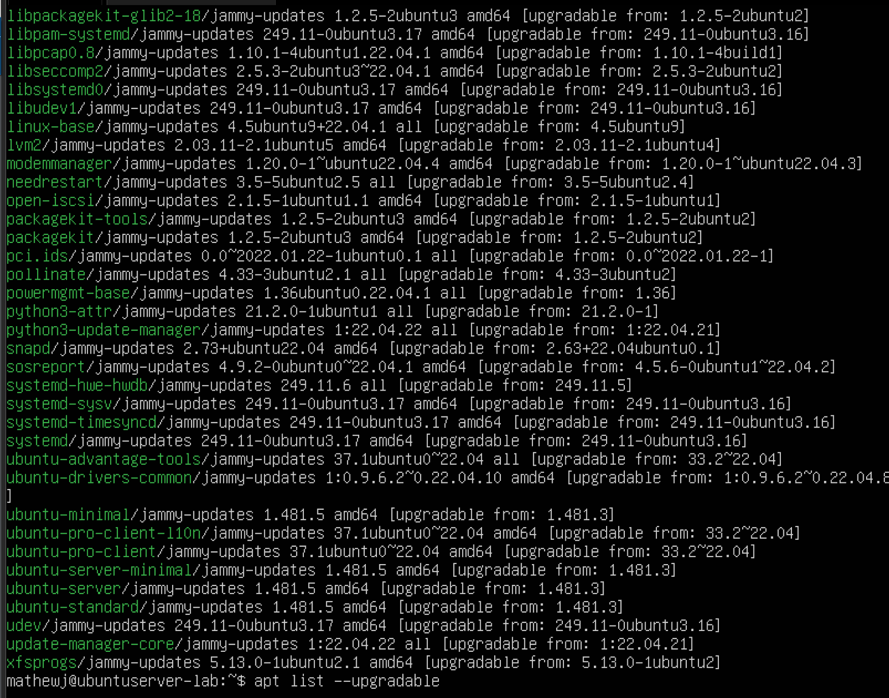
To see all upgradable items we would use the command **apt list --upgradable**. We don't need to sudo with this command as it is just listing all updgradable softwares.

**2.** 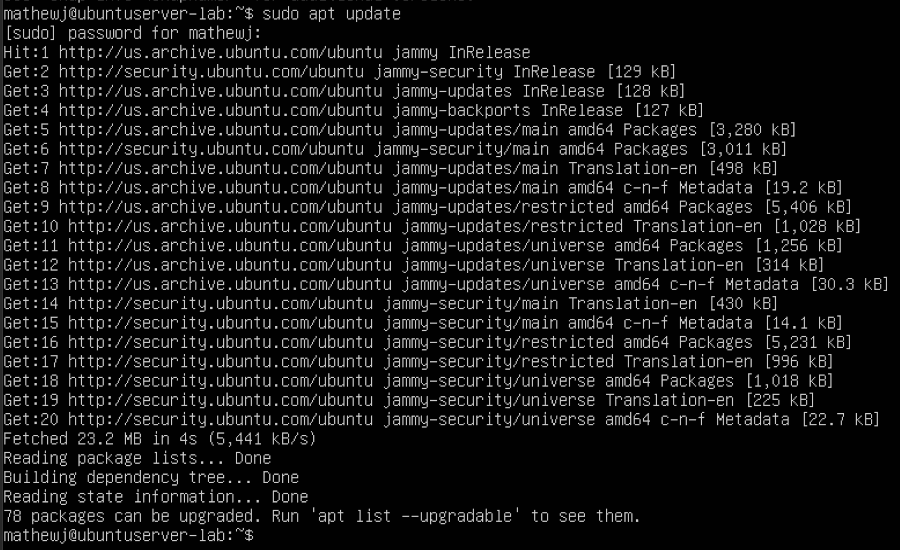 
You will do **sudo apt update** to update these upgrable softwares and you will need sudo here as it updating softwares that effect the whole system, so you will need sudo level authority.

**3.** the command is **sudo reboot** an diwll rebot the whole server. This is usally done after an update to make sure the upgrades are working properly. There is no image as the roobt also reboot the past message long from the VM.

## User Tasks:
**4.** 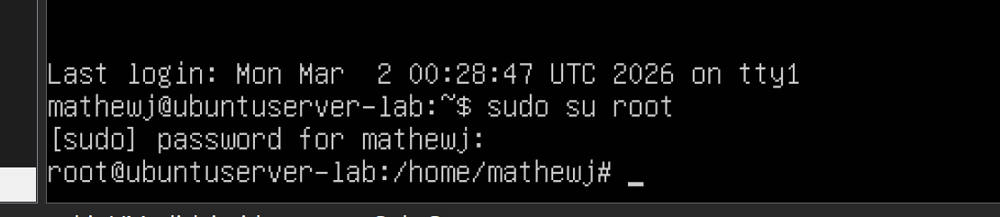
When changing to root using **sudo su root** you are promted to enter sudo access password and once logged in you see a change at the begining part of the log lines where you username was now changed to root.

**5.** 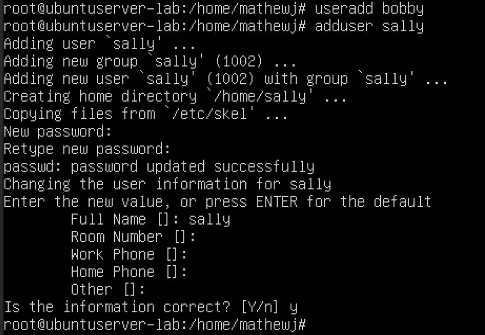
As you can ssee the difference between **useradd** and **adduser** is that the former creates a users but doesn't make them a password or home directory. While the ladder does both of these things and even adds other personal informations.

**6.** 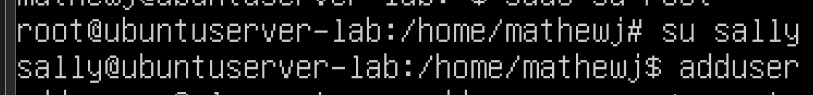
To change into sally I need to do **su sally** then put in the password for the user. The prompt for the log line now changed to sally user name instead.

**7.** 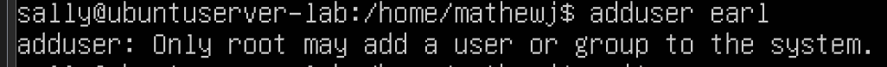
The reason even if we are in root and swap to sally to why we can't add the user is that we are no longer in root. If sally had sudo access then they would be able to create users.

**8.** 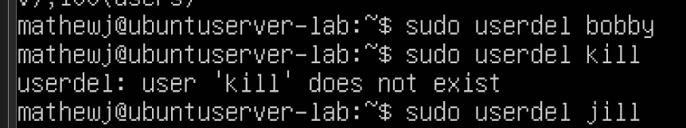
to delete a user you will enter **sudo userdel username** which should delete the user but keep their home directory. If you wish to do both then do **sudo userdel -r username**.

**9.** 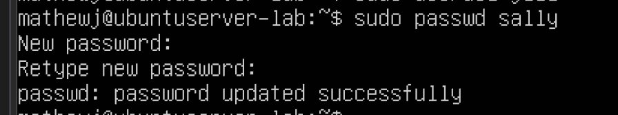

**10.** The reason it is bad pratice to stay into root to do task or commands is that, one, they are not logged so if any errors or unothrized commands were used you will have no id who did it, second, its a security rist as if you leave your desk or the commandline open then anyone passing by can type any command they want.

**11.** 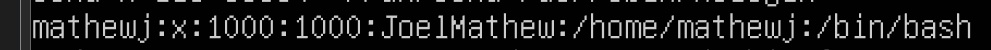
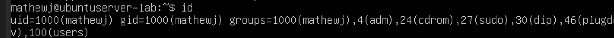
The commands to see you id is using id or you can do less /etc/passwd to see all ids with yours included.

## Group Tasks:
**12.** 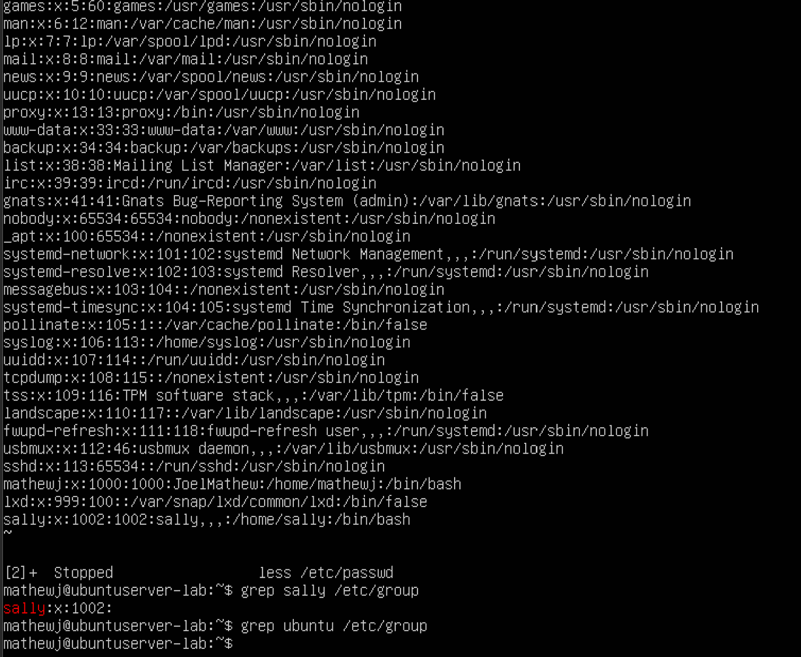
I did the **grep ubuntu /etc/group** commands and it didn't pop up then I did the all users command andd didn't see it but I put the whole list up in the image above just in case I missed it.

**13.** 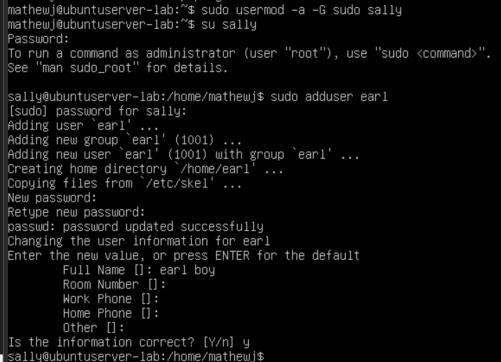
By adding sally to the sudo group, it gave her sudo access letting her now add users.

**14-16.** 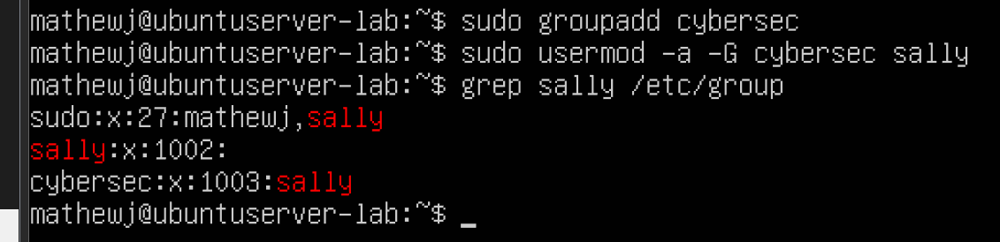
Here is how I created the group using **sudo addgroup cybersec**, then adding sally by doing **sudo usermod -a -G cybersec sally**, then to check I did **grep sallt /etc/group** but you can do **group sally**, **less /etc/passwd**, or **id sally**.
## Permission and Access Control Lists:
**17.** 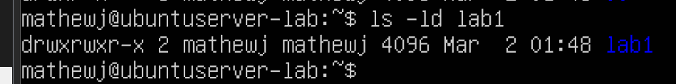
The owner is mathj same with group owner. Owner and group can read, write, and execute. While other canr ead and execute.

**18.** 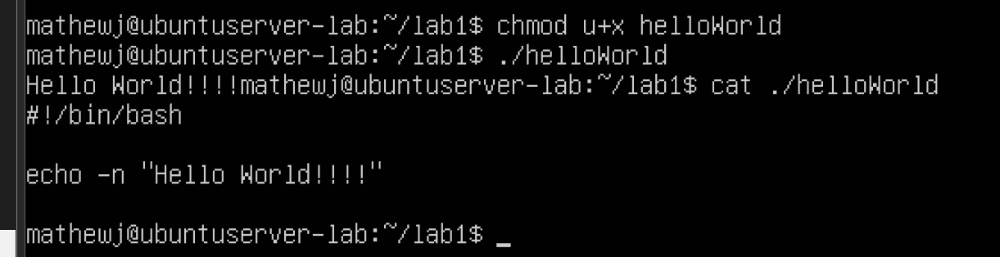
To make the words "Hello World" appear we use the bash script with echo and to make it executable you would do **chmod u+x helloWorld**.

**19.** 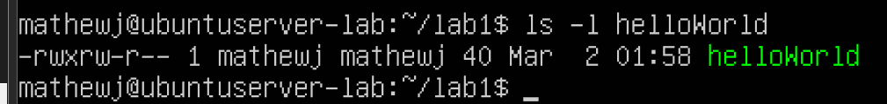
For owner we have read, write and excutable, group we have read and write, lastly for other we just have read.
**20.** 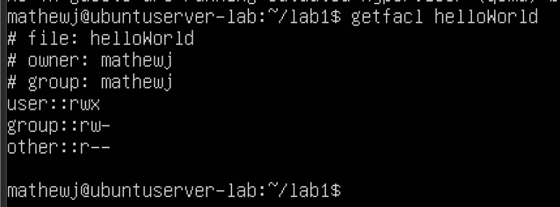

**21.**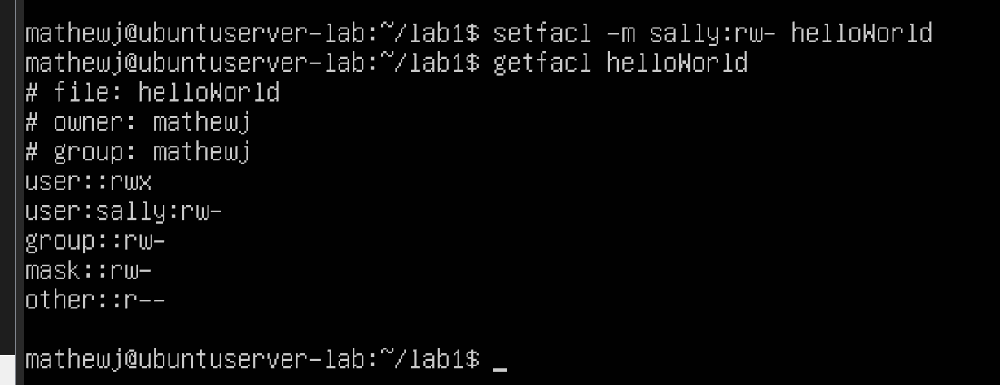

