# Assignment 3: Environment Variable and Set-UID Program Lab

## 2.1 Task 1: Manipulating Environment Variables
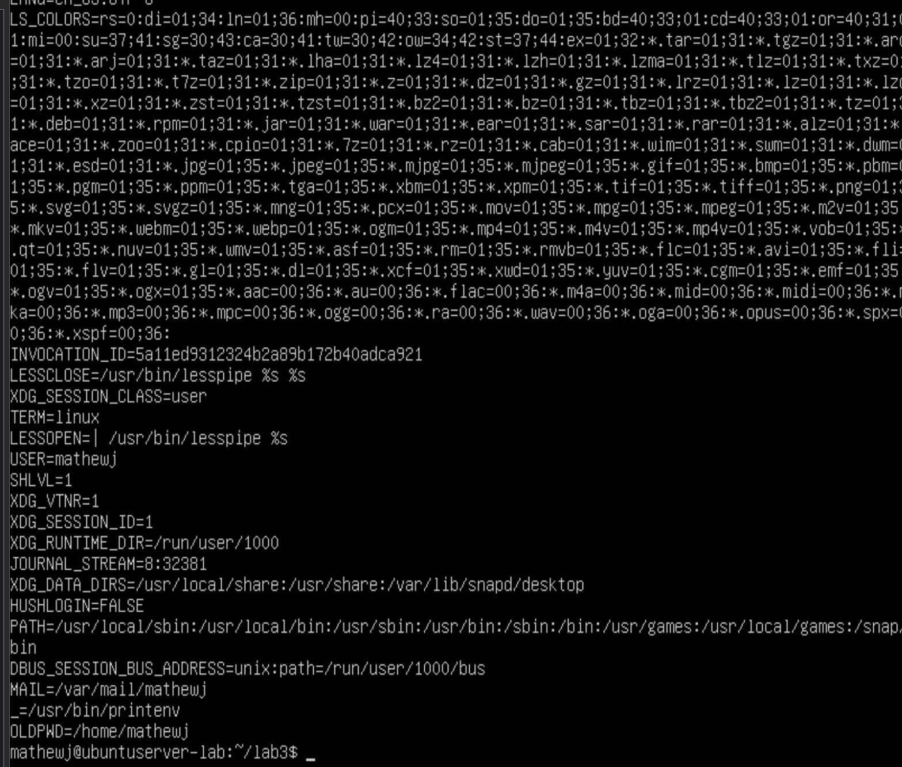
In the image we are using the printenv command which will print out all envrioment variables. 

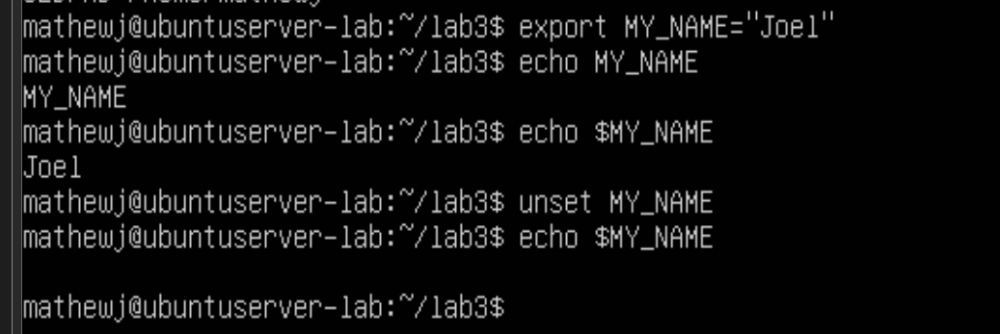
When using the command export it will create a env based on what you named it and the content of what is inside the env. When looking at echo we see one with the $ in front of the env, which is used to tell the sheel that this is a variable and I want to look insde it.
Now with the command inset it removes the env from the session.

## 2.2 Task 2: Passing Environment Variables from Parent Process to Child Process

**Step 1:** 
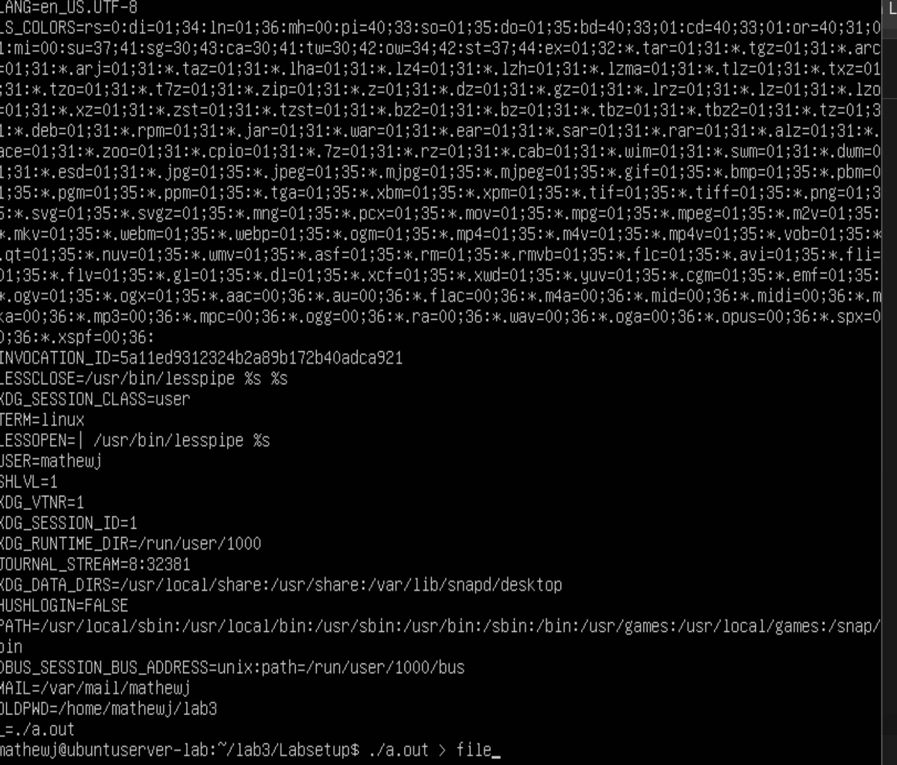
When opeing the file we can see how the child process has the same envs as the parent, which shows how the fork() command does inherit enviroment variables from praent to child.

**Step 2:**
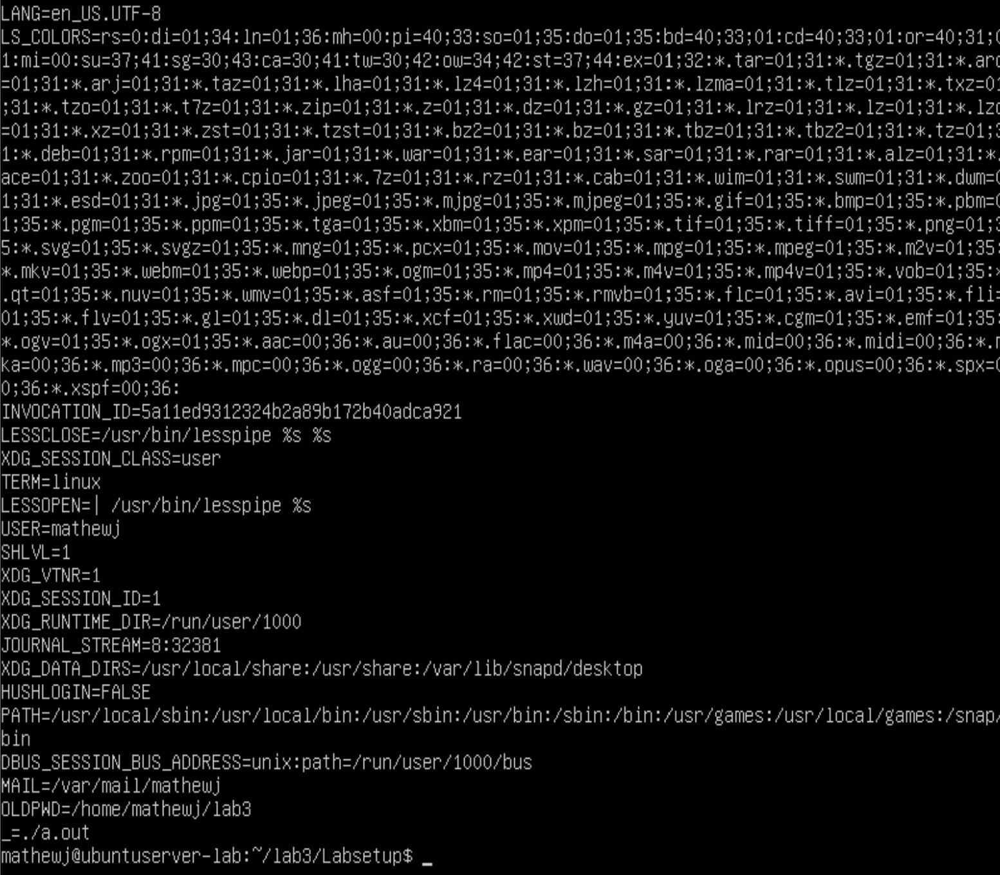
There seems to be no differnce with the files.

**Step 3:**
When looking at both files:
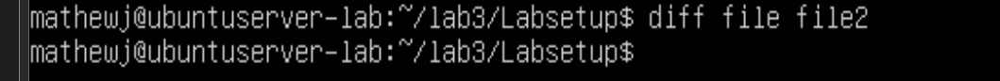 
We see how there are no differences between them as both are identical, this means that even with changes to the envs in the child after forking it will not affect the parent and vice versa.

## 2.3 Task 3: Environment Variables and execve()

**Step 1:**
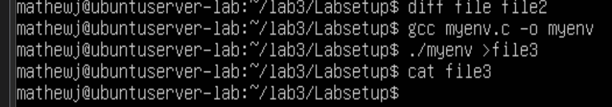
Nothing was printed out as NULL will tell execve() to pass no envs to the new program.

**Step 2:** 
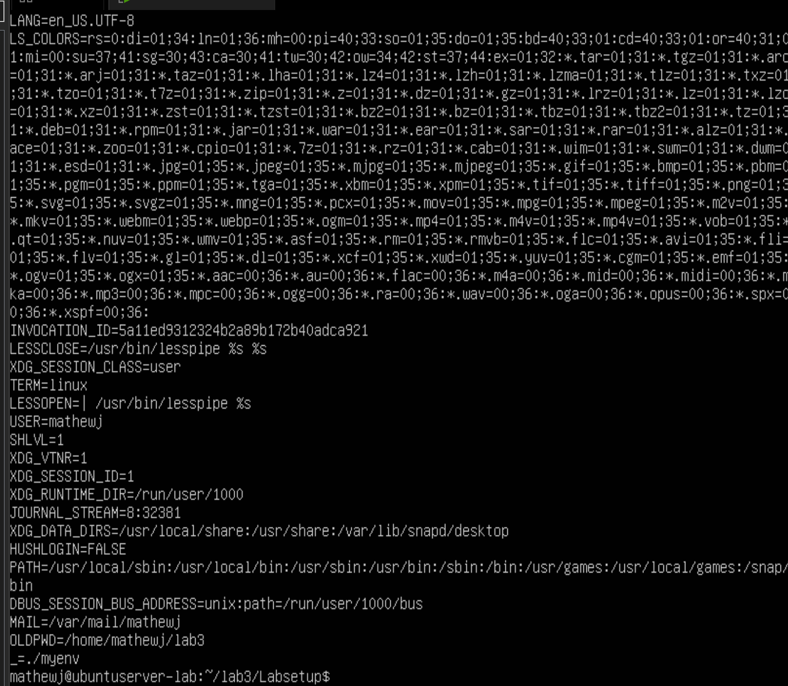
This one gets all the parent's envs.

**Step 3:** 
Unlike the fork() command the execve() command will not automatically inherit envs. You have to explicity pass them with a third argument. If you start with the NULL, the program starts with an empty env.

## 2.4 Task 4: Environment Variables and system()

**swapped to my own command line from here**
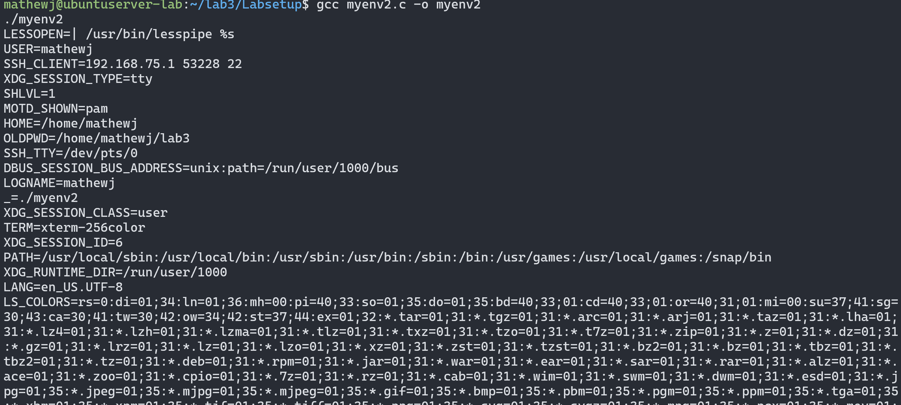
When using system() it will automatically pass the calling process's envs to the new program through a form of internal call chains. The reasion this is important for a security prespective is that if an attacker can manipulate envs, those envs will get pass to whatever ststem() exectues.

## 2.5 Task 5: Environment Variable and Set-UID Programs

**Step 1 and 2:**
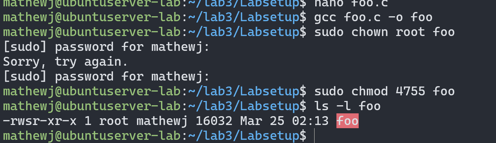
With the s in the -rwsr-xr-x we can confirm that the Set-UID is active

**Step 3:** 
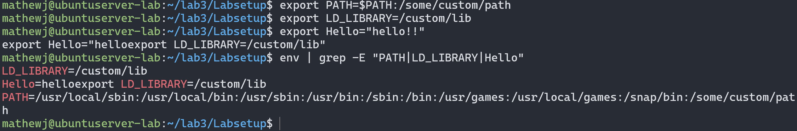
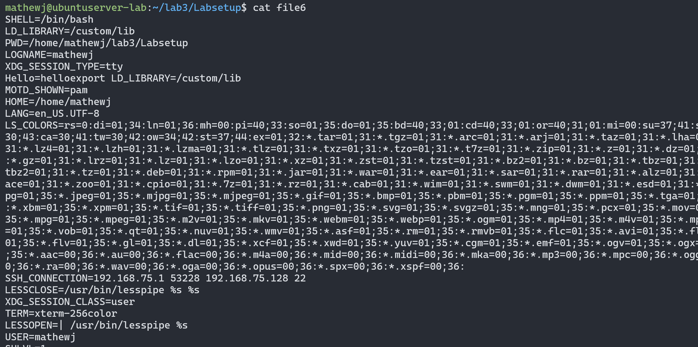
From what I can see is I can see my path and Hello env but I can't see the LD_PRELOAD or the LD_LIBRARY_PATH as they looked to be blocked.
So the Set_UID program did inherit most of the encs from my shell which can be a security risk but Linux protects against LD_* attacks.

## 2.6 Task 6: The PATHEnvironment Variable and Set-UID Programs
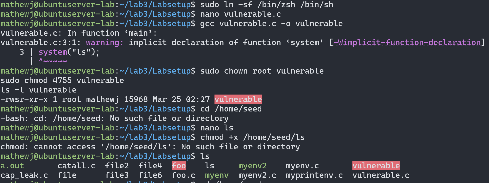
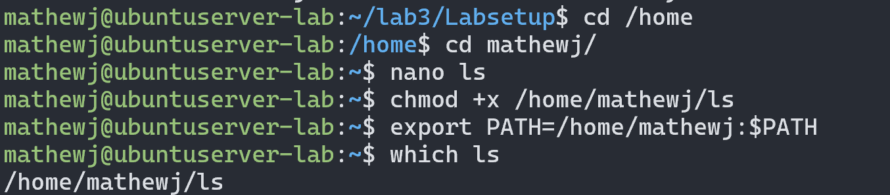
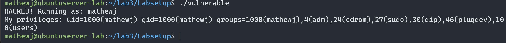

I like how it even tells me why the file I created was vulenrable. 
The reason thsi worked was lat the ls I made was used using a path /home/seed/ls so when the UID program was doing system("ls") it instead found mine as they go in orader and /bin/ls is below the one I made. Dash which I disable at the begining blocks this and drops root privileges when it dects the /bin/sh in a Set-UID program.

## 2.7 Task 7: The LD PRELOAD Environment Variable and Set-UID Programs

**Step 1:**
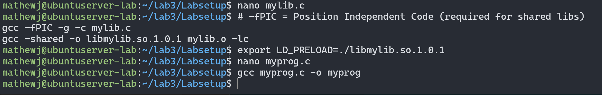

**Step 2:**
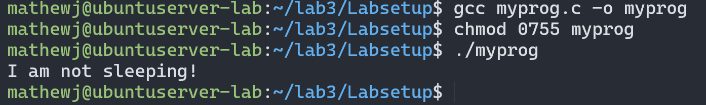
The LD_PRELOAD works and uses the fake sleep()

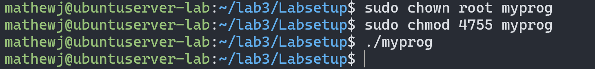
The LD_PRELOAD is ignored and the real sleep() is used

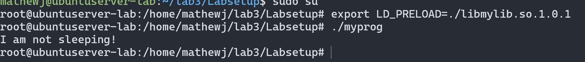
It will work again as the real user of the program is root so there is no privilege gap.

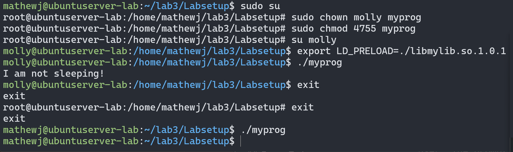
This on is also ignored. 
**Step 3:** 
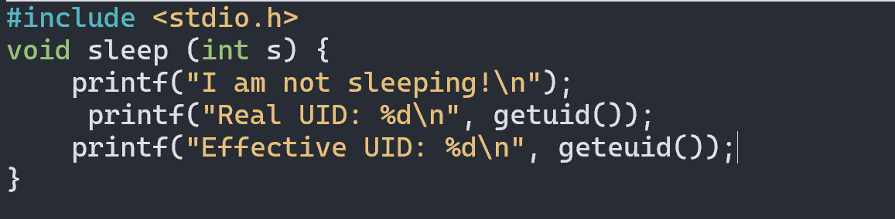
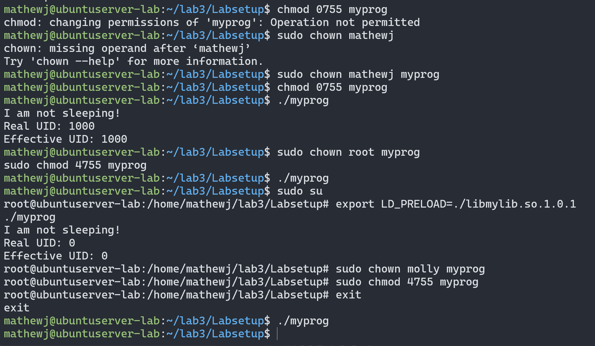
When looking here we see that with normal programs or set-UID run by root we see the RUID and the EUID are the same which is allowed, but when a Set-UID run by a normal user it will be different as the OS will strip the LD_PRELOAD. So the dynamic loader will intentionally ignores LD_PRELOAD and other LD_* variables when it detects a privilege gap between the real and effective user ID.

## 2.8 Task 8: Invoking External Programs Using system() versus execve()

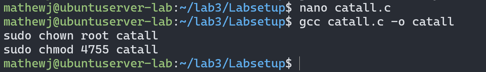

**Step 1:**
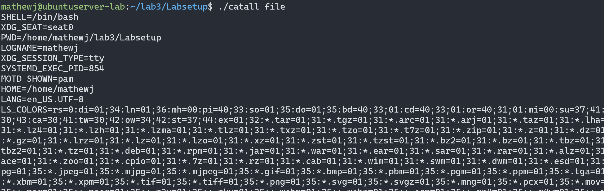
since system() passes the command to /bin/sh it can use shell characters such as ;, &&, | and etc so as shown above if called by a normal user they can put a file on the end and it cats the file but this can also:
- delete a file he should be able to
- add new root users
- get a root shell
- modify a read-only file

**Step 2:**
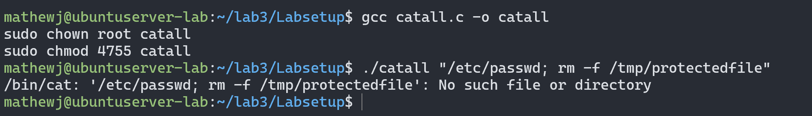

So when using execve instead of system, it will pass the arguemnts directly and not use shell like system does so it is much safer.

## 2.9 Task 9: Capability Leaking
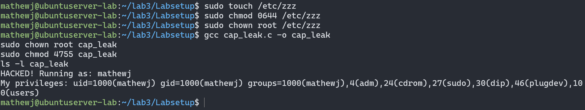
This should have opened the /etc/zzz file but I made the ls file a while back and since that is first in the /bin/sh it ran my ls file that says hacked. while aso shoung my setuids.

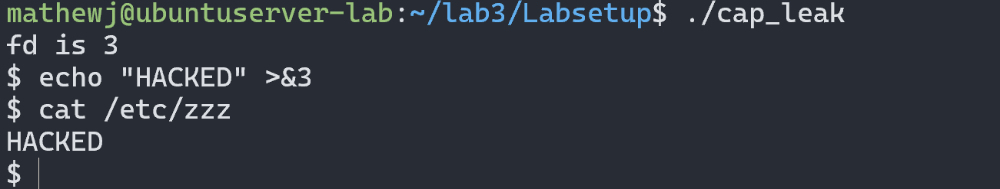
now it can be exploted and open a shell where anyone can changed things.